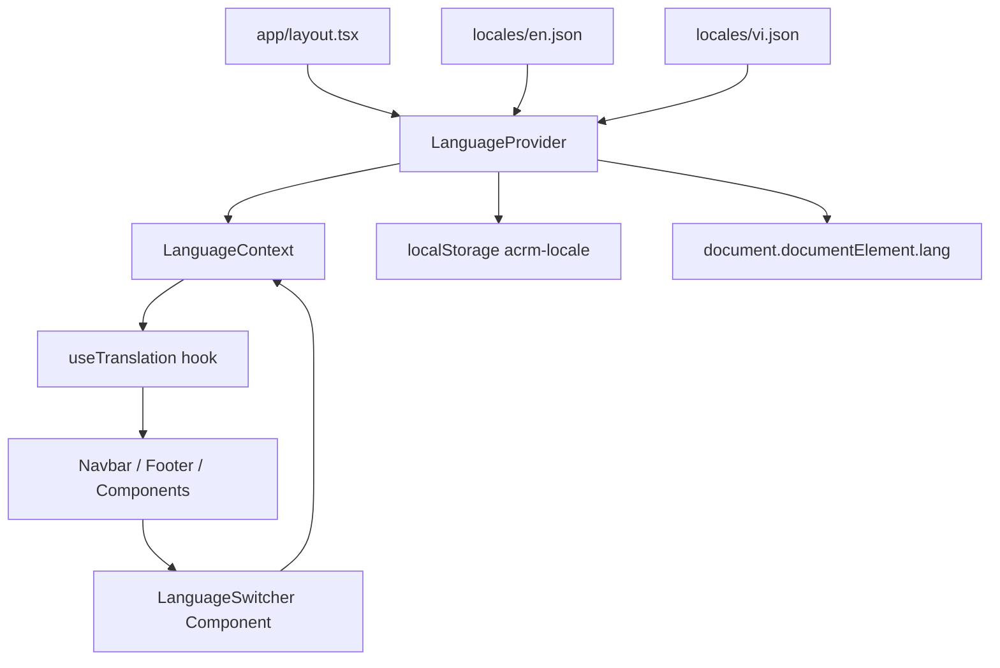
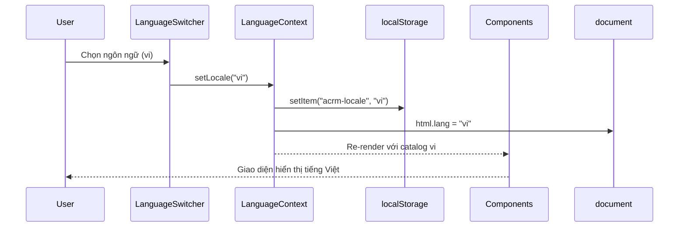
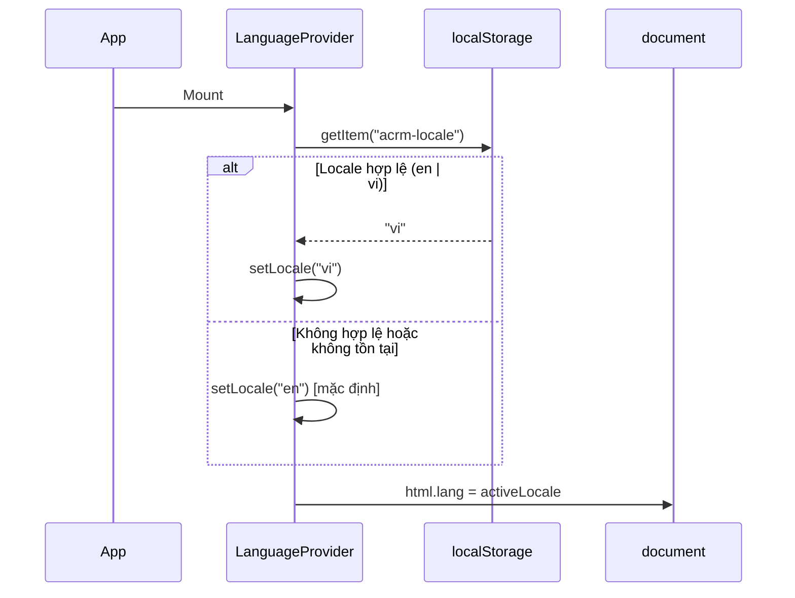

# Tài Liệu Thiết Kế: Language Switcher

## Tổng Quan

Tính năng Language Switcher cho phép người dùng ACRM chuyển đổi giao diện giữa Tiếng Anh (`en`) và Tiếng Việt (`vi`) mà không cần tải lại trang. Hệ thống i18n được xây dựng hoàn toàn bằng React Context và custom hook, không phụ thuộc vào thư viện bên ngoài, đảm bảo bundle size nhỏ và kiểm soát hoàn toàn logic dịch thuật.

Lựa chọn ngôn ngữ được lưu vào `localStorage` với khóa `acrm-locale` và được khôi phục khi ứng dụng khởi động lại. Thuộc tính `lang` của thẻ `<html>` được cập nhật đồng bộ để hỗ trợ trình đọc màn hình và SEO.

---

## Kiến Trúc

### Tổng Quan Kiến Trúc



### Luồng Dữ Liệu



### Khởi Tạo Ứng Dụng



---

## Các Thành Phần và Giao Diện

### 1. LanguageContext (`lib/i18n/context.tsx`)

Context cung cấp trạng thái ngôn ngữ và hàm thay đổi ngôn ngữ cho toàn bộ cây component.

```typescript
type Locale = "en" | "vi";

interface LanguageContextValue {
  locale: Locale;
  setLocale: (locale: Locale) => void;
  t: (key: string, fallback?: string) => string;
}
```

**Trách nhiệm:**
- Lưu trữ `locale` hiện tại trong state
- Khởi tạo locale từ `localStorage` khi mount
- Cập nhật `localStorage` và `document.documentElement.lang` khi locale thay đổi
- Cung cấp hàm `t(key)` để tra cứu bản dịch với fallback về `en`

### 2. useTranslation Hook (`lib/i18n/useTranslation.ts`)

Hook tiện ích để các component truy cập hàm dịch thuật.

```typescript
function useTranslation(): {
  t: (key: string, fallback?: string) => string;
  locale: Locale;
  setLocale: (locale: Locale) => void;
}
```

**Sử dụng trong component:**
```tsx
const { t, locale, setLocale } = useTranslation();
// t("navbar.home") => "Home" hoặc "Trang chủ"
```

### 3. LanguageSwitcher Component (`components/LanguageSwitcher.tsx`)

Component dropdown cho phép người dùng chọn ngôn ngữ, đặt trong Navbar cạnh ThemeToggle.

**Props:** Không có props (sử dụng context trực tiếp)

**Trạng thái nội bộ:**
- `isOpen: boolean` — trạng thái mở/đóng dropdown

**Hành vi:**
- Hiển thị nhãn ngắn gọn của locale hiện tại (`EN` / `VI`)
- Click mở/đóng dropdown
- Click ra ngoài đóng dropdown (sử dụng `useEffect` + `mousedown` listener)
- Phím `Escape` đóng dropdown
- Phím `Enter` / `Space` chọn ngôn ngữ đang focus
- Hiển thị dấu tích (✓) cho ngôn ngữ đang active
- Thuộc tính ARIA: `aria-label`, `aria-expanded`, `aria-haspopup`, `role="listbox"`

### 4. Translation Catalogs (`locales/en.json`, `locales/vi.json`)

File JSON với cấu trúc khóa phân cấp theo namespace.

### 5. Tích Hợp vào layout.tsx

`LanguageProvider` bọc toàn bộ `{children}` trong `RootLayout`. Thuộc tính `lang` của thẻ `<html>` được quản lý động bởi provider (không hardcode `lang="en"`).

---

## Mô Hình Dữ Liệu

### Cấu Trúc Translation Catalog

Các khóa được tổ chức theo namespace phản ánh component hoặc trang chứa text đó:

```json
{
  "navbar": {
    "home": "Home",
    "chat": "AI Chat",
    "advisor": "Advisor",
    "compare": "Compare",
    "analytics": "Analytics",
    "team": "Team",
    "startChat": "Start Chat",
    "logoSubtitle": "AI Carbon-Resilience Management"
  },
  "footer": {
    "description": "AI Carbon-Resilience Management - Measuring and optimizing AI carbon footprint in enterprises.",
    "navigation": "Navigation",
    "copyright": "ACRM Platform - AI Carbon-Resilience Management."
  },
  "hero": {
    "badge": "AI Carbon-Resilience Management Platform",
    "headline1": "Measure",
    "headline2": "Carbon Footprint",
    "headline3": "in Enterprise",
    "subtitle": "ACRM helps enterprises track, assess, and optimize CO₂ emissions from AI usage — in real-time, with a scientific 4-layer architecture.",
    "tryChat": "🚀 Try AI Chat",
    "meetTeam": "👥 Meet the Team",
    "statModels": "AI Models",
    "statRegions": "Regions",
    "statResilience": "Resilience Indexes",
    "statLayers": "Architecture Layers"
  },
  "features": {
    "sectionTitle": "Key Features",
    "sectionSubtitle": "Core tools to track AI carbon footprint and build ESG/MRV advisory drafts.",
    "realtimeTitle": "Real-time Carbon Measurement",
    "realtimeDesc": "Calculates CO2 and energy consumption for every AI interaction...",
    "regionalTitle": "Regional Carbon Intensity",
    "regionalDesc": "Supports 12 regions with distinct CI metrics...",
    "resilienceTitle": "Resilience Assessment",
    "resilienceDesc": "3 evaluation metrics: AI Carbon Exposure Index, AI Cost Shock Index, and AI Resilience Score.",
    "duplicateTitle": "Duplicate Detection",
    "duplicateDesc": "Automatically identifies similar prompts asked previously...",
    "smartTitle": "Smart Recommendation",
    "smartDesc": "Alerts when large models are used for simple tasks...",
    "advisorTitle": "ESG/MRV Advisor",
    "advisorDesc": "Generates advisory draft sections and Q&A guidance for GHG/MRV reporting..."
  },
  "architecture": {
    "sectionTitle": "4-Layer Architecture",
    "sectionSubtitle": "Scientific framework for carbon measurement"
  },
  "formula": {
    "sectionTitle": "Carbon Formula",
    "sectionSubtitle": "How we calculate CO₂ emissions"
  },
  "cta": {
    "title": "Ready to measure your AI carbon footprint?",
    "subtitle": "Start tracking emissions today.",
    "button": "Get Started"
  },
  "chat": {
    "placeholder": "Type your message...",
    "send": "Send",
    "newSession": "New Session",
    "clearHistory": "Clear History",
    "carbonLabel": "Carbon",
    "energyLabel": "Energy",
    "tokensLabel": "Tokens"
  },
  "modelSelector": {
    "label": "Model",
    "placeholder": "Select model"
  },
  "regionSelector": {
    "label": "Region",
    "placeholder": "Select region"
  },
  "sessionHistory": {
    "title": "Session History",
    "empty": "No sessions yet",
    "deleteAll": "Delete All"
  },
  "smartRecommendation": {
    "title": "Smart Recommendation",
    "suggestion": "Consider using a smaller model"
  },
  "carbonBudget": {
    "title": "Carbon Budget",
    "remaining": "Remaining",
    "used": "Used"
  },
  "scheduledTasks": {
    "title": "Scheduled Tasks",
    "noTasks": "No scheduled tasks",
    "addTask": "Add Task"
  },
  "resilienceDashboard": {
    "title": "Resilience Dashboard",
    "exposureIndex": "AI Carbon Exposure Index",
    "costShockIndex": "AI Cost Shock Index",
    "resilienceScore": "AI Resilience Score"
  },
  "advisor": {
    "title": "ESG/MRV Advisor",
    "placeholder": "Ask about GHG reporting...",
    "generate": "Generate"
  },
  "analytics": {
    "title": "Analytics",
    "totalEmissions": "Total Emissions",
    "totalEnergy": "Total Energy",
    "totalTokens": "Total Tokens"
  },
  "compare": {
    "title": "Compare Models",
    "selectModels": "Select models to compare",
    "run": "Run Comparison"
  },
  "team": {
    "title": "Our Team",
    "subtitle": "The people behind ACRM"
  },
  "languageSwitcher": {
    "ariaLabel": "Select language / Chọn ngôn ngữ",
    "english": "English",
    "vietnamese": "Tiếng Việt"
  },
  "common": {
    "loading": "Loading...",
    "error": "An error occurred",
    "retry": "Retry",
    "close": "Close",
    "save": "Save",
    "cancel": "Cancel"
  }
}
```

### Quy Tắc Tra Cứu Khóa

Hàm `t(key)` hoạt động theo logic sau:

```
1. Tách key theo dấu "." để lấy namespace và sub-key
2. Tra cứu trong catalog của locale hiện tại
3. Nếu không tìm thấy → tra cứu trong catalog "en" (fallback)
4. Nếu vẫn không tìm thấy → trả về key gốc (để dễ debug)
```

### Cấu Trúc File

```
locales/
  en.json          # Translation catalog tiếng Anh
  vi.json          # Translation catalog tiếng Việt
lib/
  i18n/
    context.tsx    # LanguageContext + LanguageProvider
    useTranslation.ts  # Custom hook
    types.ts       # Locale type, LanguageContextValue interface
components/
  LanguageSwitcher.tsx  # Dropdown component
```

### Hằng Số

```typescript
const SUPPORTED_LOCALES: Locale[] = ["en", "vi"];
const DEFAULT_LOCALE: Locale = "en";
const STORAGE_KEY = "acrm-locale";
```

---

## Correctness Properties

*A property is a characteristic or behavior that should hold true across all valid executions of a system — essentially, a formal statement about what the system should do. Properties serve as the bridge between human-readable specifications and machine-verifiable correctness guarantees.*

### Property 1: Locale lookup trả về đúng catalog

*For any* locale hợp lệ (`en` hoặc `vi`) và bất kỳ khóa dịch thuật nào tồn tại trong catalog của locale đó, hàm `t(key)` phải trả về giá trị từ đúng catalog của locale đang active — không phải từ catalog của locale khác.

**Validates: Requirements 2.4, 2.5**

---

### Property 2: Round-trip chuyển đổi ngôn ngữ

*For any* khóa dịch thuật hợp lệ, sau khi chuyển locale từ `en` sang `vi` rồi chuyển lại `en`, giá trị `t(key)` phải bằng đúng giá trị ban đầu khi locale là `en`.

**Validates: Requirements 6.2**

---

### Property 3: Persistence round-trip

*For any* locale hợp lệ, sau khi gọi `setLocale(locale)`, giá trị lưu trong `localStorage["acrm-locale"]` phải là chuỗi BCP 47 đúng của locale đó; và khi khởi tạo lại `LanguageProvider` với cùng localStorage đó, `locale` ban đầu phải bằng locale đã lưu.

**Validates: Requirements 3.1, 3.2, 3.4**

---

### Property 4: Fallback về tiếng Anh khi khóa thiếu

*For any* khóa tồn tại trong catalog `en` nhưng không tồn tại trong catalog `vi`, khi locale là `vi`, hàm `t(key)` phải trả về giá trị từ catalog `en` thay vì chuỗi rỗng hoặc lỗi.

**Validates: Requirements 4.3**

---

### Property 5: Tính đầy đủ của catalog (key parity)

*For any* khóa tồn tại trong catalog `en`, khóa đó cũng phải tồn tại trong catalog `vi` (và ngược lại). Tập hợp khóa của hai catalog phải bằng nhau.

**Validates: Requirements 4.4, 6.1**

---

### Property 6: Fallback khi localStorage không hợp lệ

*For any* giá trị không hợp lệ trong `localStorage["acrm-locale"]` (bao gồm `null`, `undefined`, chuỗi rỗng, locale không được hỗ trợ như `"fr"`, `"123"`), `LanguageProvider` phải khởi tạo với locale mặc định là `"en"`.

**Validates: Requirements 3.3**

---

### Property 7: Cập nhật lang attribute của HTML

*For any* locale hợp lệ, sau khi gọi `setLocale(locale)`, thuộc tính `document.documentElement.lang` phải bằng đúng mã locale đó.

**Validates: Requirements 5.5**

---

### Property 8: Nhãn hiển thị locale

*For any* locale hợp lệ, nhãn hiển thị trong `LanguageSwitcher` phải là phiên bản viết hoa của mã locale (`"en"` → `"EN"`, `"vi"` → `"VI"`).

**Validates: Requirements 1.2**

---

### Property 9: ARIA expanded đồng bộ với trạng thái dropdown

*For any* trạng thái của dropdown (mở hoặc đóng), thuộc tính `aria-expanded` trên nút trigger phải phản ánh đúng trạng thái đó (`"true"` khi mở, `"false"` khi đóng).

**Validates: Requirements 5.2**

---

### Property 10: Đóng dropdown không thay đổi locale

*For any* locale đang active, sau khi mở dropdown rồi đóng bằng cách click ra ngoài hoặc nhấn `Escape`, locale phải không thay đổi.

**Validates: Requirements 1.5, 5.3**

---

## Xử Lý Lỗi

| Tình huống | Hành vi |
|---|---|
| `localStorage` không khả dụng (SSR, private mode) | Bắt lỗi bằng `try/catch`, dùng `"en"` làm mặc định |
| Khóa dịch thuật không tồn tại trong catalog active | Fallback về catalog `en`; nếu vẫn không có, trả về key gốc |
| Locale không hợp lệ được truyền vào `setLocale` | Bỏ qua, giữ nguyên locale hiện tại |
| File JSON catalog bị lỗi cú pháp | Lỗi sẽ được bắt tại build time (TypeScript import) |
| Hydration mismatch (SSR vs client locale) | `LanguageProvider` dùng `useEffect` để đọc localStorage, tránh mismatch |

---

## Chiến Lược Kiểm Thử

### Phương Pháp Kép (Dual Testing Approach)

Chiến lược kiểm thử kết hợp **unit tests** cho các ví dụ cụ thể và **property-based tests** cho các thuộc tính phổ quát. Hai loại này bổ sung cho nhau và đều cần thiết.

**Unit tests** tập trung vào:
- Ví dụ cụ thể (Navbar hiển thị LanguageSwitcher, danh sách ngôn ngữ hỗ trợ)
- Điểm tích hợp giữa các component
- Edge cases và điều kiện lỗi

**Property-based tests** tập trung vào:
- Các thuộc tính phổ quát áp dụng cho mọi input hợp lệ
- Bao phủ input toàn diện thông qua random generation

### Thư Viện

- **Unit tests**: [Vitest](https://vitest.dev/) + [React Testing Library](https://testing-library.com/docs/react-testing-library/intro/)
- **Property-based tests**: [fast-check](https://fast-check.io/) — thư viện PBT cho TypeScript/JavaScript

### Cấu Hình Property Tests

- Mỗi property test chạy tối thiểu **100 iterations**
- Mỗi test được tag với comment tham chiếu property trong design:
  ```
  // Feature: language-switcher, Property {N}: {property_text}
  ```
- Mỗi correctness property được implement bởi **đúng một** property-based test

### Ví Dụ Unit Tests

```typescript
// Navbar hiển thị LanguageSwitcher (Requirement 1.1)
it("should render LanguageSwitcher in Navbar", () => {
  render(<Navbar />);
  expect(screen.getByRole("button", { name: /select language/i })).toBeInTheDocument();
});

// Danh sách ngôn ngữ hỗ trợ (Requirement 1.3)
it("should show supported locales in dropdown", async () => {
  render(<LanguageSwitcher />);
  await userEvent.click(screen.getByRole("button"));
  expect(screen.getByText("English")).toBeInTheDocument();
  expect(screen.getByText("Tiếng Việt")).toBeInTheDocument();
});

// aria-label (Requirement 5.1)
it("should have aria-label on language switcher button", () => {
  render(<LanguageSwitcher />);
  expect(screen.getByRole("button")).toHaveAttribute("aria-label");
});
```

### Ví Dụ Property Tests

```typescript
import fc from "fast-check";

// Feature: language-switcher, Property 1: Locale lookup trả về đúng catalog
it("t(key) returns value from active locale catalog", () => {
  fc.assert(
    fc.property(
      fc.constantFrom("en" as const, "vi" as const),
      fc.string({ minLength: 1 }),
      (locale, key) => {
        const { result } = renderHook(() => useTranslation(), {
          wrapper: ({ children }) => (
            <LanguageProvider initialLocale={locale}>{children}</LanguageProvider>
          ),
        });
        const value = result.current.t(key);
        // Giá trị trả về phải là string (không throw)
        expect(typeof value).toBe("string");
      }
    ),
    { numRuns: 100 }
  );
});

// Feature: language-switcher, Property 2: Round-trip chuyển đổi ngôn ngữ
it("en -> vi -> en round trip preserves translations", () => {
  fc.assert(
    fc.property(
      fc.constantFrom(...Object.keys(enCatalog).flatMap(ns =>
        Object.keys((enCatalog as any)[ns]).map(k => `${ns}.${k}`)
      )),
      (key) => {
        const { result } = renderHook(() => useTranslation(), {
          wrapper: LanguageProvider,
        });
        const original = result.current.t(key); // en
        act(() => result.current.setLocale("vi"));
        act(() => result.current.setLocale("en"));
        expect(result.current.t(key)).toBe(original);
      }
    ),
    { numRuns: 100 }
  );
});

// Feature: language-switcher, Property 5: Key parity giữa hai catalog
it("all keys in en catalog exist in vi catalog", () => {
  const enKeys = getAllKeys(enCatalog);
  const viKeys = getAllKeys(viCatalog);
  fc.assert(
    fc.property(fc.constantFrom(...enKeys), (key) => {
      expect(viKeys).toContain(key);
    }),
    { numRuns: enKeys.length }
  );
});
```

### Ma Trận Bao Phủ

| Property | Loại Test | Requirement |
|---|---|---|
| Property 1: Locale lookup | Property-based | 2.4, 2.5 |
| Property 2: Round-trip ngôn ngữ | Property-based | 6.2 |
| Property 3: Persistence round-trip | Property-based | 3.1, 3.2, 3.4 |
| Property 4: Fallback khóa thiếu | Property-based (edge-case) | 4.3 |
| Property 5: Key parity catalog | Property-based | 4.4, 6.1 |
| Property 6: Fallback localStorage | Property-based (edge-case) | 3.3 |
| Property 7: HTML lang attribute | Property-based | 5.5 |
| Property 8: Nhãn hiển thị locale | Property-based | 1.2 |
| Property 9: ARIA expanded | Property-based | 5.2 |
| Property 10: Đóng dropdown giữ locale | Property-based | 1.5, 5.3 |
| Navbar có LanguageSwitcher | Unit (example) | 1.1 |
| Danh sách ngôn ngữ hỗ trợ | Unit (example) | 1.3 |
| aria-label tồn tại | Unit (example) | 5.1 |
| Các component dùng useTranslation | Unit (example) | 2.3 |
